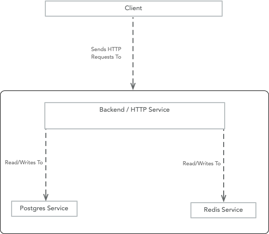

# Infra technical

# Objective

Dockerize each supplemented service and then implement container orchestration via `docker-compose`.

# Requirements

The system components are as follows:

1. Client -- A statically built front-end that is served to browsers.
   - makes HTTP requests to the API server (2)
2. HTTP Server -- Serves an HTTP API that is consumed by the client (1).
   - requires Redis (3) and Postgresql (4) services to operate.
3. Redis -- A redis service that operates as a cache for the server
   - does not have any persistence requirements
   - needs to be configured via the provided `./redis/redis.conf` file as a bind-mount
4. Postgresql -- A postgresql service that operates as a persistence layer for the server
   - needs persistence across service interuptions such as restarts.

The 4 above services need to communicate to each other, and be orchestrated via docker-compose. A template docker-compose file has been provided `./docker-compose-template.yml`.

# Bonuses

- How would you make the client and server services hot-reloadable?
- How would you make final image size smaller?
- What steps should be taken to make subsequent builds faster?
- What could you do you have greater network isolation between services?

- Staging Deployment Description
- Decouple the Repo (Client and Server) to mitigate build congestion
- Make action pipelines more DRY
- Figure out how to get the Server connected to ElastiCache
- Figure out how to automate full revert PR's